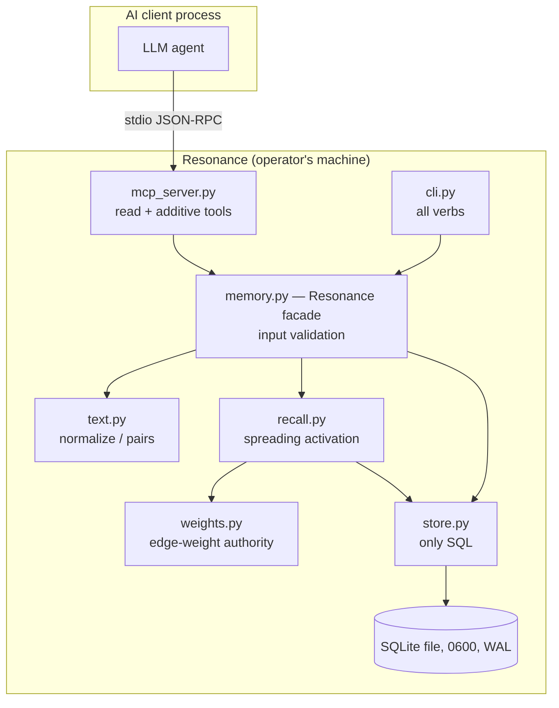

# Architecture Graph — Resonance

```mermaid
graph TD
  subgraph "AI client process"
    AI[LLM agent]
  end
  subgraph "Resonance (operator's machine)"
    MCP[mcp_server.py<br/>read + additive tools]
    CLI[cli.py<br/>all verbs]
    MEM[memory.py — Resonance facade<br/>input validation]
    TXT[text.py<br/>normalize / pairs]
    W[weights.py<br/>edge-weight authority]
    REC[recall.py<br/>spreading activation]
    ST[store.py<br/>only SQL]
    DB[(SQLite file, 0600, WAL)]
  end
  AI -- stdio JSON-RPC --> MCP
  MCP --> MEM
  CLI --> MEM
  MEM --> TXT
  MEM --> REC
  MEM --> ST
  REC --> W
  REC --> ST
  ST --> DB
```
